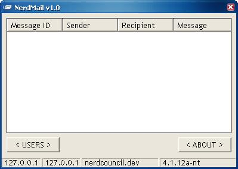



## NerdMail :: Complete POP/SMTP Server

### Description

Finally, a complete POP/SMTP server based on MySQL (my previous one did not feature an MTA). Complete with APOP support and support for the EHLO command, this is THE free mail server (if you have access to a MySQL database).

If ANYTHING does not work, leave me a comment and it'll be fixed ASAP!

Last but not least, PLEASE vote! I spent many hours on this code, and would like some feedback (good or bad)!
 
### More Info
 

             |
---                |---
**Submitted On**   |2005-08-01 17:11:22
**By**             |[sp4sm69](https://github.com/Planet-Source-Code/PSCIndex/blob/master/ByAuthor/sp4sm69.md)
**Level**          |Intermediate
**User Rating**    |4.7 (14 globes from 3 users)
**Compatibility**  |VB 6\.0
**Category**       |[Internet/ HTML](https://github.com/Planet-Source-Code/PSCIndex/blob/master/ByCategory/internet-html__1-34.md)
**World**          |[Visual Basic](https://github.com/Planet-Source-Code/PSCIndex/blob/master/ByWorld/visual-basic.md)
**Archive File**   |[NerdMail\_\_191979812005\.zip](https://github.com/Planet-Source-Code/sp4sm69-nerdmail-complete-pop-smtp-server__1-62021/archive/master.zip)

